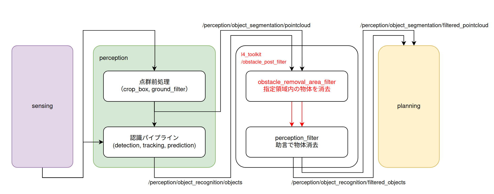
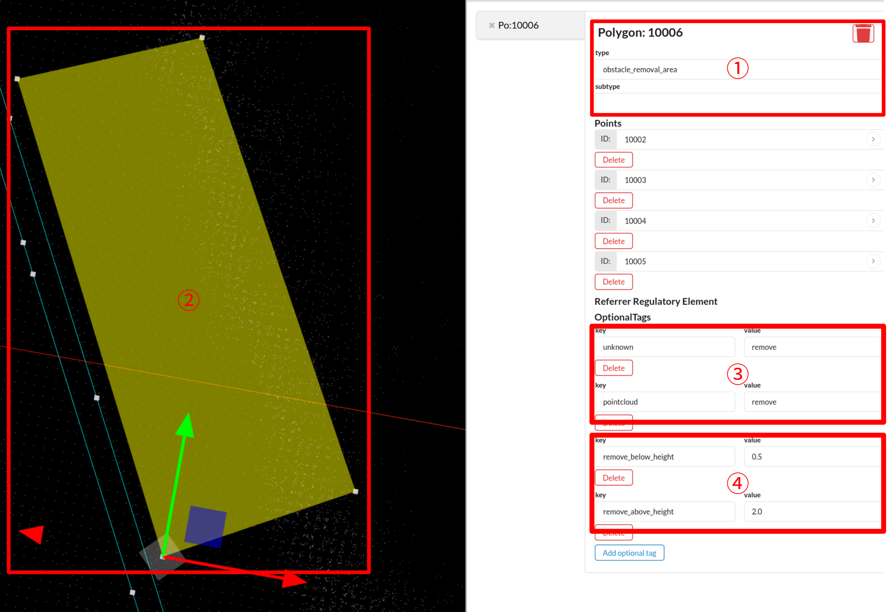

# obstacle_removal_area_filter

## 概要
`obstacle_removal_area_filter` は、入力された「物体（Objects）」や「点群（PointCloud）」に対し、指定された領域内にあるデータを除去して出力する機能です。

本機能は必須ではありませんが、人間の判断による補助や調整を加えることで、自動運転システムの安定性や価値を高めることを目的としています。主に **AutowareのPerception（認識）モジュールとPlanning（計画）モジュールの間** に配置して使用することを想定しています。



除去する領域は高精度地図（Lanelet2）上で定義します。Laneletのタグ設定により、特定の物体種別（歩行者、車両、点群など）のみを除去したり、高さ制限を設けて除去範囲を限定したりすることが可能です。

## 設定項目と挙動

### パラメータ設定（Global）
点群と物体それぞれに対して、フィルタ処理を適用するか否かを一括で設定できます。
エリアごとに設定することも可能ですが、計算負荷を考慮して、処理自体をスキップしたい場合などはこの全体設定を変更してください。

### エリアごとの設定（Lanelet2）
除去領域として使用する各Laneletポリゴンには、以下の設定が必要です。

1.  **Type指定**: `obstacle_removal_area_filter` の対象であることを示すタグ
2.  **領域形状**: Lanelet上の点列から作成されるポリゴン
3.  **除去対象**: 除去を行う物体の種別（タグで指定）
4.  **高さ制限**: 高さ情報の指定（任意）



#### 1. Lanelet Type
Polygon layerのlanelet要素として定義し、`type` タグに `obstacle_removal_area` を設定してください。
`subtype`は不要です。

#### 2. 領域設定
Lanelet上の点列によってポリゴンを設定します。判定仕様を加味した上で、適切な形状に設定してください。
内外判定自体はxy（水平方向）座標のみを用いて行われますが、可視化の都合でz座標についても、適切な設定が必要です。

**ポリゴンと物体との内外判定仕様**:
  * **物体**: 物体の「重心」が領域内にある場合、その物体は出力されなくなります。
  * **点群**: 各点が領域内にある場合、その点は出力されなくなります。

> **注意**: 物体に対する判定は、あくまで「重心」に対する内外判定です。「物体の外形（バウンディングボックス）が領域と重なっている」あるいは「外形が完全に含まれている」という判定ではありません。（※必要であれば、この判定ロジックを切り替えるオプションの実装は比較的容易です。）

#### 3. 物体種別設定
除去したい物体種別をタグで指定します。複数の種別を対象にする場合は、それぞれのタグを追加してください。
物体種別がKeyに登録されていない場合、またはValueが `remove` 以外の場合は除去されません。

* **Key**: 物体種別 (下記リスト参照)
* **Value**: `remove`

**サポートされている物体種別 (Key)**

| Key | 対象 |
| :--- | :--- |
| `all` | すべての認識物体（Objects）および点群（PointCloud） |
| `all_objects` | すべての認識物体 |
| `pointcloud` | 点群データ |
| `unknown`, `car`, `truck`, `bus`, `trailer`, `motorcycle`, `bicycle`, `pedestrian` | 対応する認識物体 |

#### 4. 高さ設定（任意）
高さを条件に除去範囲を制限することができます。

この機能は、Laneletポリゴンの「重心の高さ（標高）」を基準高さとして動作します。そのため、ポリゴンの構成点には適切な高さ（z座標）を設定してください。基本的には、路面（歩道ではなく車道）の高さに合わせることを推奨します。
高さフィルタ用のタグが設定されていない場合、ポリゴンの高さ情報は可視化にのみ影響します。

> **注意**: 水平方向（XY平面）の判定とは異なり、高さ方向の判定では物体の重心ではなく「物体の占有領域（高さの範囲）」を考慮します。

| Key | Value例 | 説明 |
| :--- | :--- | :--- |
| **remove_below_height** | `0.5` | 指定した高さ（m）より**下**にある物体を除去します。<br>（例：雑草や地面付近のノイズ除去など） |
| **remove_above_height** | `2.0` | 指定した高さ（m）より**上**にある物体を除去します。<br>（例：看板や街路樹などの誤検出防止など） |

## Lanelet OSM file example

以下は、OSMファイルでの記述例です。

```xml
  <way id="89151">
    <nd ref="89141"/>
    <nd ref="89145"/>
    <nd ref="89146"/>
    <nd ref="89150"/>
    <nd ref="89141"/>
    <tag k="type" v="obstacle_removal_area"/>
    <tag k="area" v="yes"/>
    <tag k="unknown" v="remove"/>
    <tag k="pointcloud" v="remove"/>
    <tag k="remove_below_height" v="0.5"/>
    <tag k="remove_above_height" v="2.0"/>
  </way>